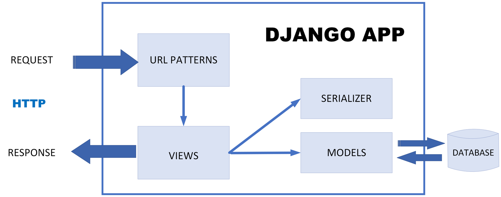

# NZ_NYZviszga
Német Zoltán Nyisztor Zoltán Kovács Marcell Vizsgaremek dokumentáció 

 

Az általunk készített alkalmazás egy lézer vágó cég raktár kezelését végzi, amelyben a raktárban tárolt alapanyagokat(különböző anyag típusok) és a megrendeléseket nyilván tartását végzi.
Az alkalmazásban nyomon követhető, hogy egy anyagot jelen esetbe egy lemez táblát a melyik dolgozó használta fel és melyik megrendeléshez. 
Az alkalmazás webes felhasználó felületű, amely a  Django Framework segítségével van megoldva. 
A webes felület tartalmaz egy qr kódot amely segítségével telefonon is kezelhető a felület. 

Django framework: https://www.djangoproject.com/ 

A Django Framework kezeli az Mysql adatbázist és segítségével van megjelenítve a webes kezelő felület. 
A adatbázist a XAMPP laklamazás kezeli.

XAMPP mysql webserver: https://www.apachefriends.org/hu/index.html

A felhasználói felület és az adtbázis közötti kapcsolatot a XAMPP alkalmazás biztosítja a Django Framework-ön keresztül. 

A webes kezelő felület html, css fájlokból tevődik össze. Az sql adatbázis kapcsolatot pedig a django framework biztosítja. 

A prjrct leírása, dokumentációja: https://sites.google.com/view/arba-lemezkez-project/f%C5%91oldal

---
A betöltő oldal egy bejelentkező (login)form.
Szükséges megadni a nevet és jelszőt.
A főoldal aszerint töltődik be, hogy ki fogja használni az alkalmazást.
1. admin
2. raktáros
3. operator(lézervágó)

Adim:
Teljes hozzáférés a raktárkezeléshez és adatbázis módosításáshoz.
- új dolgozó felvétele
- régi dolgozó törlése
- új anyagok rögzítése
- adatbázis karbantartása
  
Raktáros:
- anyag kiadása
- anyag bevétele
- hiány esetén megrendelés rögzítése

Operator:
- új munka rögzítése
- a munkához szükséges anyag kiválasztása
- befejezett munka rögzítése(szükség esetén munkalap nyomtatása)

Munkalap tartalma:
- a munka sorszáma
- felhasznált alap anyag
- munka kezdete
- munka vége
- dolgozó neve
- munka megnevezése ha van

  
- 

- Figma minta:
https://www.figma.com/file/dhj0E8Fwr5VxQ5VDCPejjW/Inventory-Management-system-(Community)?type=design&node-id=0%3A1&mode=design&t=pe2mPrLWeKtfYyed-1

Django környezet létrehozása windows és linux op rendszeren:
---
Windows:
---
- mkdir nznyz_vizsga
- cd nznyz_vizsga
- python -m venv raktar_venv
- cd raktar_venv
- Scripts\activate
- pip install django
- django-admin stratproject config
- rename config backend # config mappa átnevezése backendre
- cd backend
- pip freeze > requirements.txt # a telepítési követelmény létrehozása txt fájlba
- python manage.py migrate
- python manage.py createsperuser
- python manage.py runserver

- python manage.py startapp raktar_app  # raktar app létrehozása

- code .  # a project megnyitása visual studio code alkalmazásban

Linux:
---
- mkdir nznyz_vizsga
- cd nznyz_vizsga
- python3 -m venv raktar_venv
- source raktar_venv/bin/activate
- pip install django
- django-admin stratproject config
- mv config backend # # config mappa átnevezése backendre
- cd backend
- pip freeze > requirements.txt  # a telepítési követelmény létrehozása txt fájlba
- python3 manage.py migrate
- python3 manage.py createsperuser
- python3 manage.py runserver

- python3 manage.py startapp raktar_app

- code .

Adatbázis dump fájl étrehozása
---
from django.core.management import call_command

output = open(output_filename,'w') # Point stdout at a file for dumping data to.
call_command('dumpdata','model_name',format='json',indent=3,stdout=output)
output.close()

A Django REST Framework fő összetevői a következők:
---

- A kép linkje: https://www.thetechplatform.com/post/exploring-django-rest-framework-building-powerful-apis-with-ease
- Requests: A kéréseket az ügyfelek küldik az API-nak. Ezek lehetnek GET, POST, PUT vagy DELETE kérések, és tartalmazhatnak adatokat JSON vagy más formátumban.
- URL patterns:  Az URL-minták arra szolgálnak, hogy a kéréseket meghatározott nézetekhez igazítsák.
- Views: A Views felelős a kérések kezeléséért és a válaszok generálásáért.
- Serializers:  A sorosítók felelősek a Python-objektumok és a JSON közötti adatok konvertálásáért.
- Models: A modellek Django objektumok, amelyek az API által közzétett adatokat képviselik.

------------------------
2024-01-29

Német Zoltán Nyisztor Zoltán Vizsgaremek dokumentáció:

001 - A program bemutatása:
Az általunk készített alkalmazás egy lézervágó cég fémipari lemeznyilvántartását végzi. Az alakalmazás neve: ARBA-LemezKez
A készletnyilvántartás célja: Mindig tudjuk, melyik termékből [lemezből] mennyi van és azok hol találhatóak a raktárban.
A tiszta, rendezett raktár és a precíz nyilvántartás fél siker. Ez azt jelenti, hogy minden raktári mozgásnak pontosan le kell tükröződnie a készletnyilvántartásban is.
Az alkalmazás a raktárban tárolt különféle anyagok (különböző típusok) nyilvántartását és a megrendeléseket kezeli, hogy könnyen nyomon követhető legyen, hogy egy adott anyagot vagy lemezt melyik dolgozó használta fel, és melyik megrendeléshez kapcsolódik.
Az alkalmazás célja, hogy segítsen optimalizálni a raktári folyamatokat [Lemez beérkezése] és növelje a hatékonyságot [A keresett lemez pontos helyének meghatározása].
A program webes felülettel rendelkezik, ami tartalmaz egy QR kódot is. Ennek segítségével okostelefonon is könnyen elérhető az applikáció.

Django Framework és Mysql segítségével lett létrehozva.

Django framework: https://www.djangoproject.com/

A Django Framework kezeli az Mysql adatbázist és segítségével van megjelenítve a webes kezelő felület. A adatbázist a XAMPP laklamazás kezeli.

XAMPP mysql webserver: https://www.apachefriends.org/hu/index.html

A felhasználói felület és az adtbázis közötti kapcsolatot a XAMPP alkalmazás biztosítja a Django Framework-ön keresztül.

A webes kezelő felület html, css fájlokból tevődik össze. Az sql adatbázis kapcsolatot pedig a django framework biztosítja.

Mi ezzel a megoldással hatékonnyá tesszük a raktári lemezkezelést. Így biztosítható az, hogy mindig precíz kimutatásunk legyen a készletünk [tárolt lemeztáblák] mennyiségéről.
A mindennapi raktári feladatokat és havi elszámolásokat szolgáló jelentések ezekből generálhatók, és ezek képezik a hatékony logisztikai folyamatok alapjait.

Hibaelhárítás, adatok helyességének ellenőrzése: havonta elvégzett szemrevételezős leltározás a készletnyilvántartást ellenőrzi.

Dimenziós polcrendszer: az a rendszer lehetővé teszi a termékek elhelyezését a polcokon úgy, hogy minden terméket egyedi dimenziók, méretek vagy más jellemzők alapján csoportosítanak. Így a tárolt tételek könnyebben azonosíthatók és kezelhetők. Előnyei közé tartozik a térhatékonyság, a gyorsabb árukiszolgálás és az átláthatóság növelése a raktárban.

alapanyag, készáru.....................

002 - Felhasználóbarát felület:
Az alkalmazás könnyen kezelhető grafikus felhasználói felülettel rendelkezik, amely lehetővé teszi a felhasználók számára gyors és egyszerű navigációt, így könnyedén megtalálhatják a keresett lemeztáblákat.

003 - Automatizált lemezkezelés:
Az ARBA-LemezKez előre definiált lemezkezelési funkciókkal rendelkezik, amelyek lehetővé teszik az adatok gyors és pontos rögzítését, minimalizálva a hibalehetőségeket és csökkentve az időráfordítást. [fix lemezvastagságok, anyagminőség, méret] Ezzel elkerülve a begépelési hibák számát.

004 - Valós idejű raktári készletnyilvántartás:
A felhasználók valós idejű készletnyilvántartás révén az alkalmazás lehetővé teszi a raktáron lévő termékek pontos és naprakész követését.
Diagrammon megjelenítve a lemezek elosztását.

005 - Felhasználói fiókok létrehozása, szerkesztése, kezelése, jogosultságok:
Felhasználói fiókok létrehozása:
-A rendszergazdának jogosultsága van új felhasználói fiókok létrehozására. Ez általában egy adminisztrációs felületen vagy parancssorban történik, ahol meg kell adni a felhasználói nevet, jelszót és egy céges emailcímet. Az új fiókoknak egyedi azonosítóval kell rendelkezniük, és a rendszernek ellenőriznie kell, hogy nincs-e olyan felhasználói név vagy azonosító, amely már létezik.

Felhasználói fiókok szerkesztése:
-A rendszergazdának lehetősége van szerkeszteni a már meglévő felhasználói fiókokat. Ez magában foglalhatja a felhasználói név, jelszó, e-mail cím és egyéb információk módosítását.

Felhasználói fiókok kezelése:
-A rendszergazdának jogosultsága van a felhasználói fiókok kezelésére, beleértve azok blokkolását, aktiválását vagy törlését.
A rendszergazda figyeli a fiókokat és ellenőrzi az esetleges biztonsági problémákkal rendelkező felhasználókat.

Jogosultságok kezelése:
-A rendszergazda szabályozza, hogy mely felhasználók rendelkezzenek a megfelelő jogosultságokkal a rendszeren belül.
Ez magában foglalhatja az adatokhoz való hozzáférést, az adatok módosításának jogosultságát.
A jogosultságok segítségével a rendszergazda biztosíthatja, hogy minden felhasználó csak azokhoz az erőforrásokhoz férjen hozzá, amelyek szükségesek a munkájához, és elkerülhetik az illetéktelen hozzáférést [törlést, adatvesztést].

006 - Átfogó riportok és analitika:
Az alkalmazás részletes riportokat és adatok elemzését kínálja, amelyek segítségével a felhasználók könnyen áttekintést kaphatnak a raktári lemezhasználatról.

007 - Beépített riasztási rendszer:
Az ARBA-LemezKez automatikus riasztásokkal látja el a felhasználókat, így segítve a problémák gyors és hatékony kezelését.
-alacsony lemezkészlet [3 egész tábla alatt]
-lejárt határidejű megrendelés

008 - Mobilalkalmazás támogatás:
Az alkalmazás elérhető mobilalkalmazásként is, lehetővé téve a felhasználók számára a raktármenedzsmentet cégen belül bárhol és bármikor használhassák.

009 - Biztonság és adatvédelem:
.............................................

IKONKÉSZLET:
home
key
refresh
search
settings
menu-burger
add-document
user-add
print
forklift-operation
