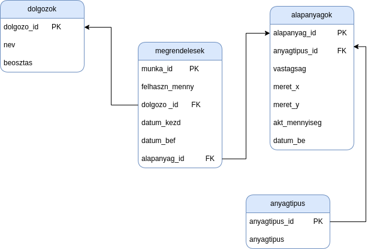

# NZ_NYZviszga
Német Zoltán Nyisztor Zoltán Vizsgaremek dokumentáció 

 

Az általunk készített alkalmazás egy lézer vágó cég raktár kezelését végzi, amelyben a raktárban tárolt alapanyagokat(különböző anyag típusok) és a megrendeléseket nyilván tartását végzi.
Az alkalmazásban nyomon követhető, hogy egy anyagot jelen esetbe egy lemez táblát a melyik dolgozó használta fel és melyik megrendeléshez. 
Az alkalmazás webes felhasználó felületű, amely a  Django Framework segítségével van megoldva. 
A webes felület tartalmaz egy qr kódot amely segítségével telefonon is kezelhető a felület. 

Django framework: https://www.djangoproject.com/ 

A Django Framework kezeli az Mysql adatbázist és segítségével van megjelenítve a webes kezelő felület. 
A adatbázist a XAMPP laklamazás kezeli.

XAMPP mysql webserver: https://www.apachefriends.org/hu/index.html

A felhasználói felület és az adtbázis közötti kapcsolatot a XAMPP alkalmazás biztosítja a Django Framework-ön keresztül. 

A webes kezelő felület html, css fájlokból tevődik össze. Az sql adatbázis kapcsolatot pedig a django framework biztosítja. 

---
A betöltő oldal egy bejelentkező (login)form.
Szükséges megadni a nevet és jelszőt.
A főoldal aszerint töltődik be, hogy ki fogja használni az alkalmazást.
1. admin
2. raktáros
3. operator(lézervágó)

Adim:
Teljes hozzáférés a raktárkezeléshez és adatbázis módosításáshoz.
- új dolgozó felvétele
- régi dolgozó törlése
- új anyagok rögzítése
- adatbázis karbantartása
  
Raktáros:
- anyag kiadása
- anyag bevétele
- hiány esetén megrendelés rögzítése

Operator:
- új munka rögzítése
- a munkához szükséges anyag kiválasztása
- befejezett munka rögzítése(szükség esetén munkalap nyomtatása)

Munkalap tartalma:
- a munka sorszáma
- felhasznált alap anyag
- munka kezdete
- munka vége
- dolgozó neve
- munka megnevezése ha van
- 
-
Figma minta:
https://www.figma.com/file/dhj0E8Fwr5VxQ5VDCPejjW/Inventory-Management-system-(Community)?type=design&node-id=0%3A1&mode=design&t=pe2mPrLWeKtfYyed-1
---
Django környezet létrehozása windows és linux op rendszeren:
---
Windows:
---
- mkdir nznyz_vizsga
- cd nznyz_vizsga
- python -m venv raktar_venv
- cd raktar_venv
- Scripts\activate
- pip install django
- django-admin stratproject config
- rename config backend # config mappa átnevezése backendre
- cd backend
- pip freeze > requirements.txt # a telepítési követelmény létrehozása txt fájlba
- python manage.py migrate
- python manage.py createsperuser
- python manage.py runserver

- python manage.py startapp raktar_app  # raktar app létrehozása

- code .  # a project megnyitása visual studio code alkalmazásban

Linux:
---
- mkdir nznyz_vizsga
- cd nznyz_vizsga
- python3 -m venv raktar_venv
- source raktar_lemezkezeles/bin/activate
- pip install django
- django-admin stratproject config
- mv config backend # # config mappa átnevezése backendre
- cd backend
- pip freeze > requirements.txt  # a telepítési követelmény létrehozása txt fájlba
- python manage.py migrate
- python manage.py createsperuser
- python manage.py runserver

- python manage.py startapp raktar_app

- code .

Adatbázis dump fájl étrehozása
---
from django.core.management import call_command

output = open(output_filename,'w') # Point stdout at a file for dumping data to.
call_command('dumpdata','model_name',format='json',indent=3,stdout=output)
output.close()

